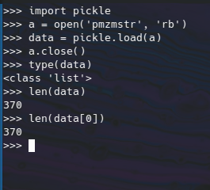
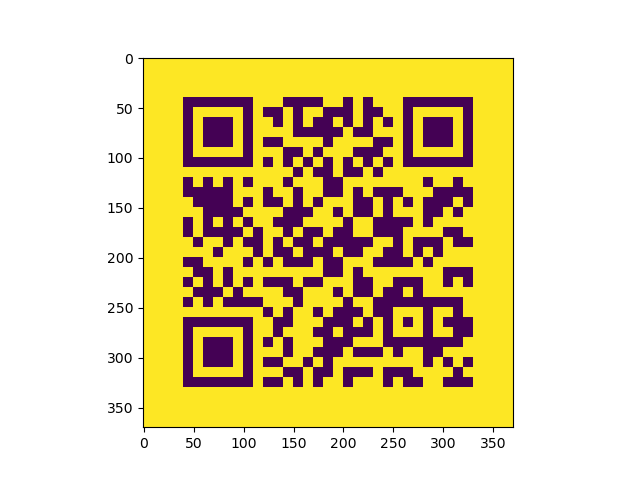
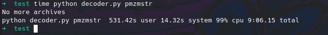

# Cucumber Writeup

Cucumber is a misc challenge, you're provided a zip file, it's a classical challenge matryoshka style zip, each zip contain another zip and the final zip contain the flag.

The first zip is encrypted, the password is `insec` I don't know if that was clear, I mean players are here in MCSC organized by insec, however I thought no one found it so I added it as a hint xD.

## The file format

After the first decryption we find two files: `pmzmstr` and `pmzmstr.7z` (the file names were generated randomly), `pmzmstr.7z` is encrypted and it's clear that we need to get the key from `pmzmstr`, and I think the hardest part of the challenge is what is `pmzmstr` format ?? Well... it's a pickle file! How you can find the format you say? The challenge name is **Cucumber** and  I even added a hint: `It's all pickled`, wasn't it clear? xD

## Automation 1 

Let's load the file in pickle:



Oh it's an `int` array, more precisely a 370x370 matrix maybe it's an image? Let's view it !



It's a QR code ! After scanning it we find: `M)H)/,TPM3ALALT(8O/NP(FTCJCAUG`. And guess what ? It's the key to decrypt the `pmzmstr.7z` archive, GREAT :D 

## Automation 2 

We got now two files `elfhwrs` and `elfhwrs.7z` we do the same thing we did with `pmzmstr` but this time we find a 3x396 matrix, plotting it we find:


Does it seems familiar? That's because this is `morse code` And after decoding it we find: `PWN(CB7MELZPT)3N3N-UU)5O(G991)`. It's the key of `elfhwrs.7z` :) 

## Automation final

Now let's put everything together. We can follow this simple algorithm:

1. Get the data from the pickle file 
2. See if it's morse or QR 
3. Decode it 
4. Unzip the archive
5. Repeat

And here is my proposed solution:

```Python
import pickle
import py7zr as p7z
from pyzbar.pyzbar import decode
import numpy as np
from PIL import Image
from sys import argv
import os


MORSE_CODE_DICT = { 'A':'.-', 'B':'-...',
                    'C':'-.-.', 'D':'-..', 'E':'.',
                    'F':'..-.', 'G':'--.', 'H':'....',
                    'I':'..', 'J':'.---', 'K':'-.-',
                    'L':'.-..', 'M':'--', 'N':'-.',
                    'O':'---', 'P':'.--.', 'Q':'--.-',
                    'R':'.-.', 'S':'...', 'T':'-',
                    'U':'..-', 'V':'...-', 'W':'.--',
                    'X':'-..-', 'Y':'-.--', 'Z':'--..',
                    '1':'.----', '2':'..---', '3':'...--',
                    '4':'....-', '5':'.....', '6':'-....',
                    '7':'--...', '8':'---..', '9':'----.',
                    '0':'-----', ',':'--..--', '.':'.-.-.-',
                    '?':'..--..', '/':'-..-.', '-':'-....-',
                    '(':'-.--.', ')':'-.--.-'}

REV_MORSE = {v:k for k,v in MORSE_CODE_DICT.items()}

def get_data(path):
    f = open(path, 'rb')
    data = pickle.load(f)
    f.close()
    return np.array(data)

def morse_or_qr(data):
    if data.shape[0] == 3:
        return 'morse'
    return 'qr'

def unmorser(data):
    T = data.T
    r = ''
    i = 0
    last = T[0]
    c = 0
    while i < len(T):
        i += 1
        if all(T[i-1] == 0):
            if c == 0:
                yield r
                r = ''
            if c == 1:
                c = 0
                r += '.'
            if c == 3:
                c = 0
                r += '-'
        else:
            c += 1

def morse_to_str(morse):
    return ''.join(list(
            map(
                lambda x: REV_MORSE[x],
                morse
                )
            ))

def unmorse(data):
    z = []
    for i in unmorser(data):
        if i != '':
            z.append(i)
    return morse_to_str(z)

def unqr(data):
    img = Image.fromarray(np.uint8(data * 255), 'L')
    return decode(img)[0].data.decode()


def unarchive(name):
    a = get_data(name)
    if morse_or_qr(a) == 'morse':
        key = unmorse(a)
    else:
        key = unqr(a)
    with p7z.SevenZipFile(name + '.7z', 'r', password=key) as archive:
        allfiles = archive.getnames()
        archive.extractall(path=".")
    os.system("rm " + name)
    os.system("rm " + name + ".7z")
    return allfiles

if __name__ == '__main__':
    first = [0,argv[1]]
    while True:
        try:
            print(first[1], end='\r')
            first = unarchive(first[1])
        except:
            break
    print("No more archives")
```

## UNZIP

Let's run the script we will give it `pmzmstr` as argument (It may take a while, for me it was ~9 min, after all we iterate over 2000 zip xD)



## Last files 

We find two pickle files: `key` and `encflag`

`key` contains: `XDTHEREISNOKEYJUSTSUBMITIT` with proper spacing: 'XD THERE IS NO KEY JUST SUBMIT IT'. Funny am I not xD?

`encflag` contains the flag: `insec{W4s_1t_fun?_A_w4lk_1n_th3_p4rk_r1ght?}`
