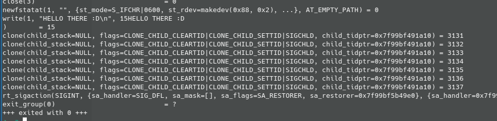

# Foo Writeup

Foo is a Stego challenge, you're provided an ELF file (it may not execute, showing an error that you need python2, just install it :P)

After running the file it print to the screen: `HELLO THERE :D`, let's try it with `strace`:

Oh 7 clones, we can also see that with `ps`:

After that you may be stuck, but remember it's a stego challenge this means the flag is just there in front of you :)

There was also a hint mentioning that there is a memory leak (There was no memory leak, it was just an indication to open your resources monitor xD)

You'll need a system/resources monitor that provide a CPU graph (it's better if you close all the other programs to see clearly what's happening):

We can see a text repeating: `__/ I AM A LAMA \__`

FLAG: `insec{__/ I AM A LAMA \__}`

# Credits

_I got the idea from:_ ![][https://codegolf.stackexchange.com/questions/33059/draw-with-your-cpu]
