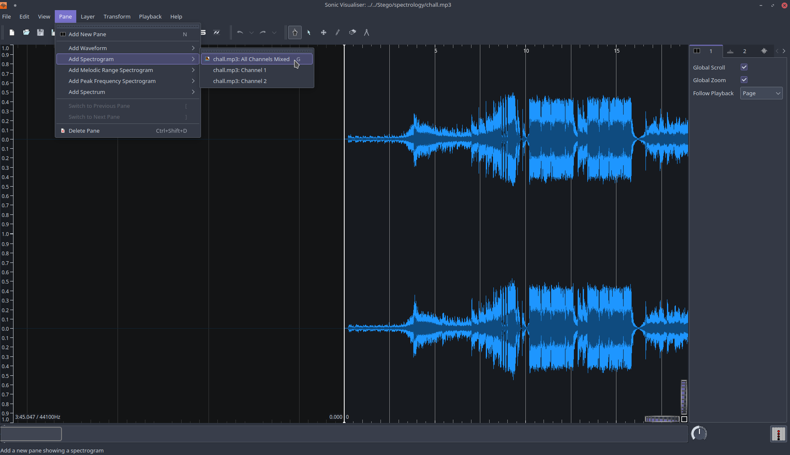
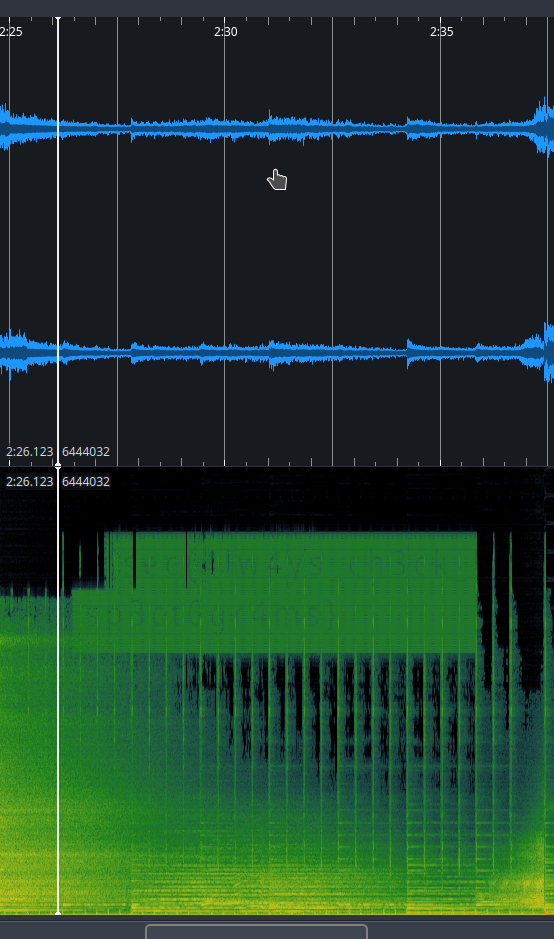
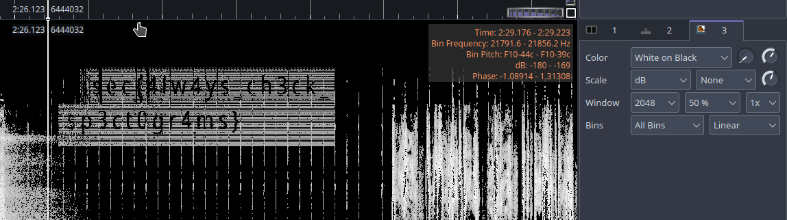

# LoL Writeup

LoL is a stego challenge, you're provided an `mp3` file, it contains `Take Over (World 2020)` you'll know it if you are a League of Legends fan.

A quick search on possible stego techniques show that the spectogram might contains something :D, we use `Sonic Visualiser` for viewing the spectogram:

We find the flag near `2:30 min`:

We can see it more clearly with the following configuration:

FLAG: `insec{4lw4ys_ch3ck_sp3ct0gr4ms}`
