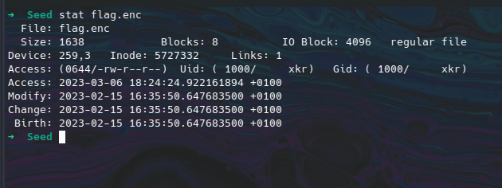
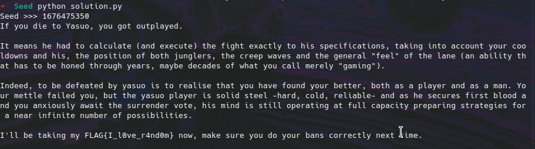

# Seed Writeup

Seed is a crypto challenge, you're provided a zip file containing the encrypted flag, and the encryption script.

## Creating the decrypt function

First let's create a decrypt function from the encryption script. We have the following relation:
  (215 * msg) + (151 * key) = secret `mod` 256
  215 * msg = secret - (151 * key) `mod` 256
  msg = inv_215 * (secret - (151 * key)) `mod` 256
with `inv_215 = 231` the inverse of 215 in Z/256Z 

We obtain the following decryption function:

```Python
def decrypt(encText, key):
    r215 = pow(215, -1, 256) # Reverse of 215 in Z/256Z
    return bytes(
        map(
            lambda x: (r215 * ( x[0] - 151 * x[1] )) % 256,
            zip(
                encText,
                key * (1 + len(encText) // len(key))
            )
        )
    )
```

## Getting the key

We can see that the key is generated by: `key = bytes(random.choices(string.printable[:-5].encode(), k=16))` the following line take 16 random element from `string.printable[:-5]` but before that we have: `random.seed(int(time()))`.

If we can get the seed we can generate the same key! And the seed is `int(time())` this mean if we can get the time when the script was ran we have the seed :D 

And just after these lines the script encrypt the flag and immediately write it to `flag.enc` (which is inside the zip file provided by the challenge) and with the `stat` command we can get the last modify time and thus get the same seed.

Here is the whole script to decrypt the file:

```Python
import string
import random

def decrypt(encText, key):
    r215 = pow(215, -1, 256) # Reverse of 215 in Z/256Z
    return bytes(
        map(
            lambda x: (r215 * ( x[0] - 151 * x[1] )) % 256,
            zip(
                encText,
                key * (1 + len(encText) // len(key))
            )
        )
    )

# To get the seed you simply need the last modify time of flag.enc in unix timestamp
# You can get the last modify time with the `stat` command
# And there are a lot of tools to convert it to unix timestamp (don't forget the timezone !!)

seed = int(input("Seed >>> "))
random.seed(seed)

# Same seed same key
original_key = random.choices(string.printable[:-5].encode(), k=16)

encText = bytes.fromhex(open('flag.enc', 'rt').read())
print(decrypt(encText, original_key).decode())
```

Let's try it, first the seed:



We convert it to unix timestamp, and beware it's GMT+1 so in GMT : `2023-02-15 15:35:50` (Some converters will take care of the timezone) thus the seed: `1676475350`

Execution:


