# unholy Writeup

unholy is a web challenge, where you are provided a site that check if your flag is correct and there are two methods to solve it.

## Method 1: Hacker senses

Open debugger and locate the wasm file:

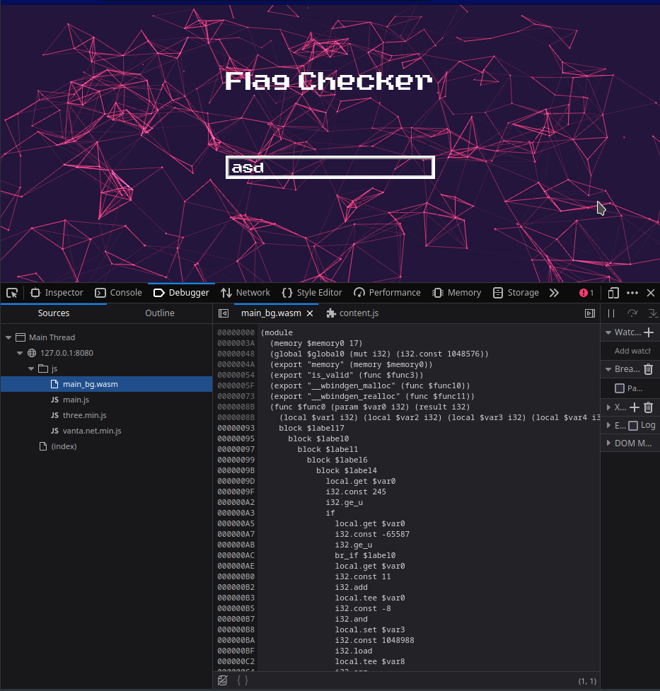

Notice some very big numbers starting from `0000161A`:

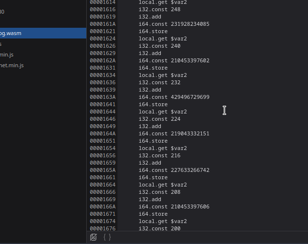

Copy and paste all the numbers (and yes I did it by hand):

```Python
nums = [231928234085, 210453397602, 429496729699, 429496729699, 429496729699,
    210453397606, 206158430307, 227633266738, 438086664249, 206158430258,
    425201762356, 231928234083, 420906795108, 206158430308, 206158430260,
    244813135928, 429496729702, 244813135969, 231928234032, 223338299492,
    408021893229, 493921239092, 511101108319, 519691042924, 206158430312,
    472446402645, 528280977507, 433791697011, 472446402665, 253403070464]
```

To byte as `big endian` then remove the `\x00` and join everything:

```Python
from struct import pack

nums = [231928234085, 210453397602,429496729699,219043332151,227633266742,210453397606,206158430307,
  227633266738,438086664249,206158430258,425201762356,231928234083,420906795108,
  206158430308,206158430260,244813135928,429496729702,244813135969,231928234032,
  223338299492,408021893229,493921239092,511101108319,519691042924,206158430312,
  472446402645,528280977507,433791697011,472446402665,253403070464]

def unpack(z, l):
    q = [pack(z, i).replace(b'\x00', b'') for i in l]
    return b''.join(q).decode()

print(unpack('>Q', nums)[::-1])
```

RESULT:
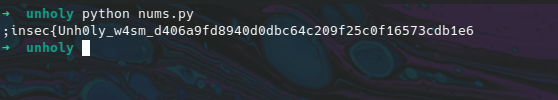

_Don't forget the `}` at the end_


## Method 2: Memory Inspector

Well since your input is being compared to the flag, you can try your luck and see what's in the memory. I'll be using chrome since it comes with a nice memory inspector, put a breakpoint in `is_valid`:

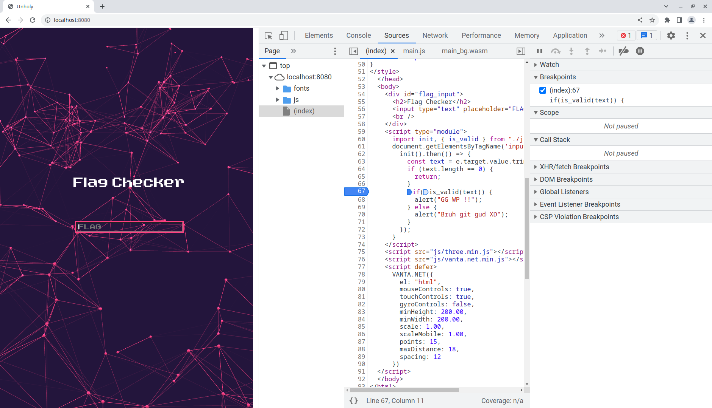

After some steps we find the `is_valid` function in the wasm file it seems to compare our flag length to `59` if it's not equal it exits.

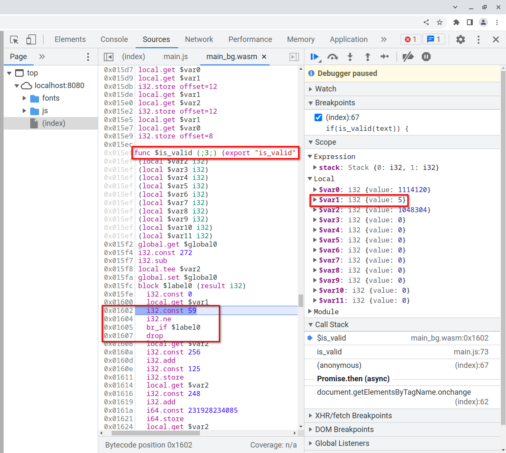

Let's try again with a 59 len text:

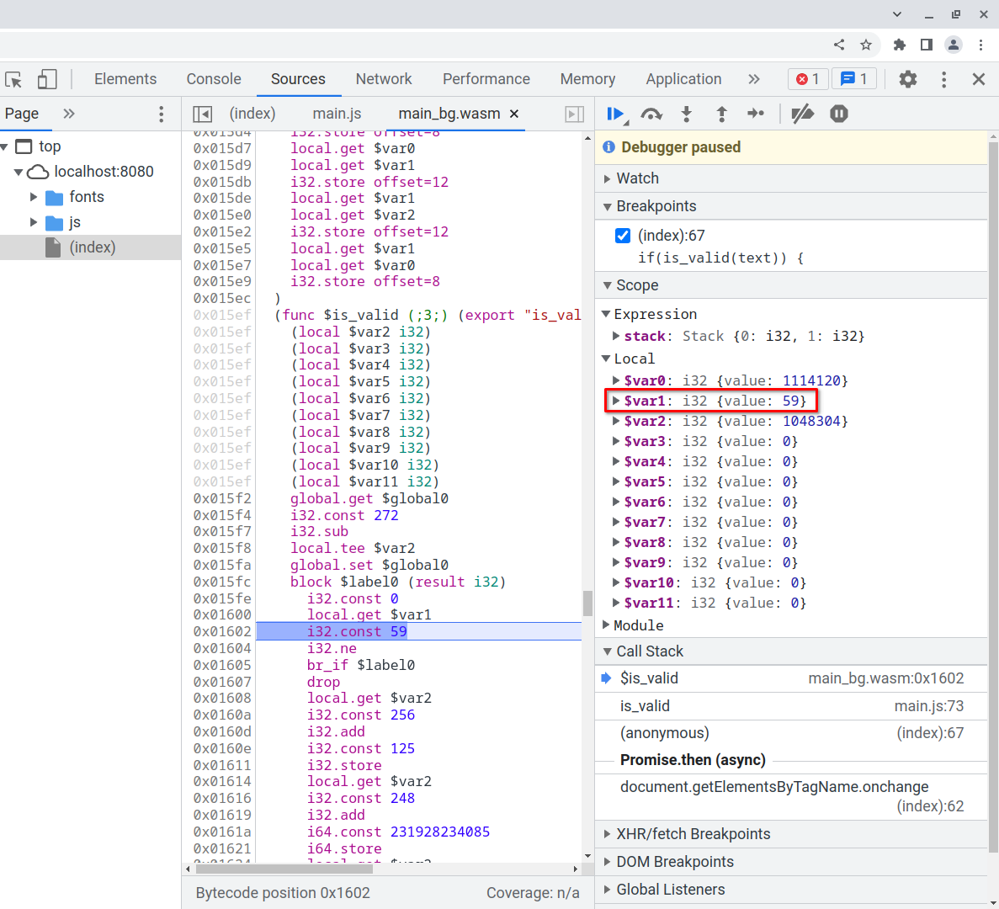

Nice now let's put a breakpoint before the end of the function, and try to see what's in the memory:

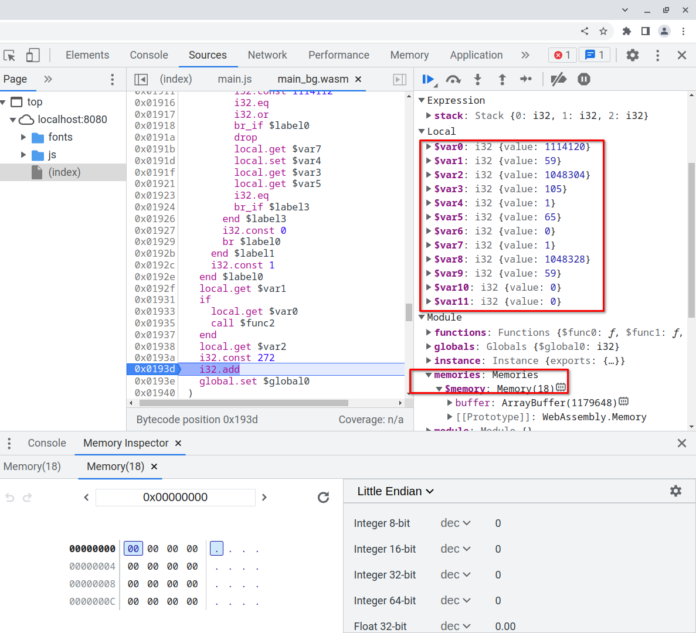

Let's visit the address of ` $var0` which is `1114120` in hex `0x110008`

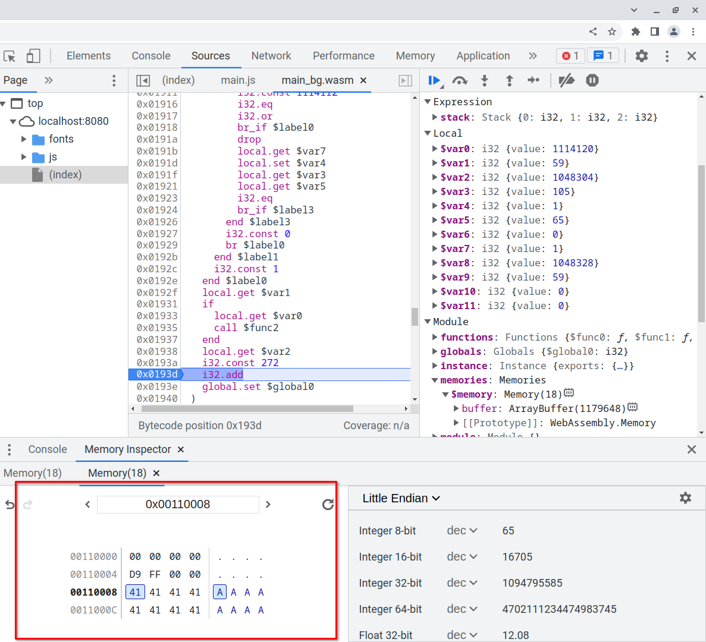

Nice it's my input! And now if you did the same with ` $var8` you will find the flag !

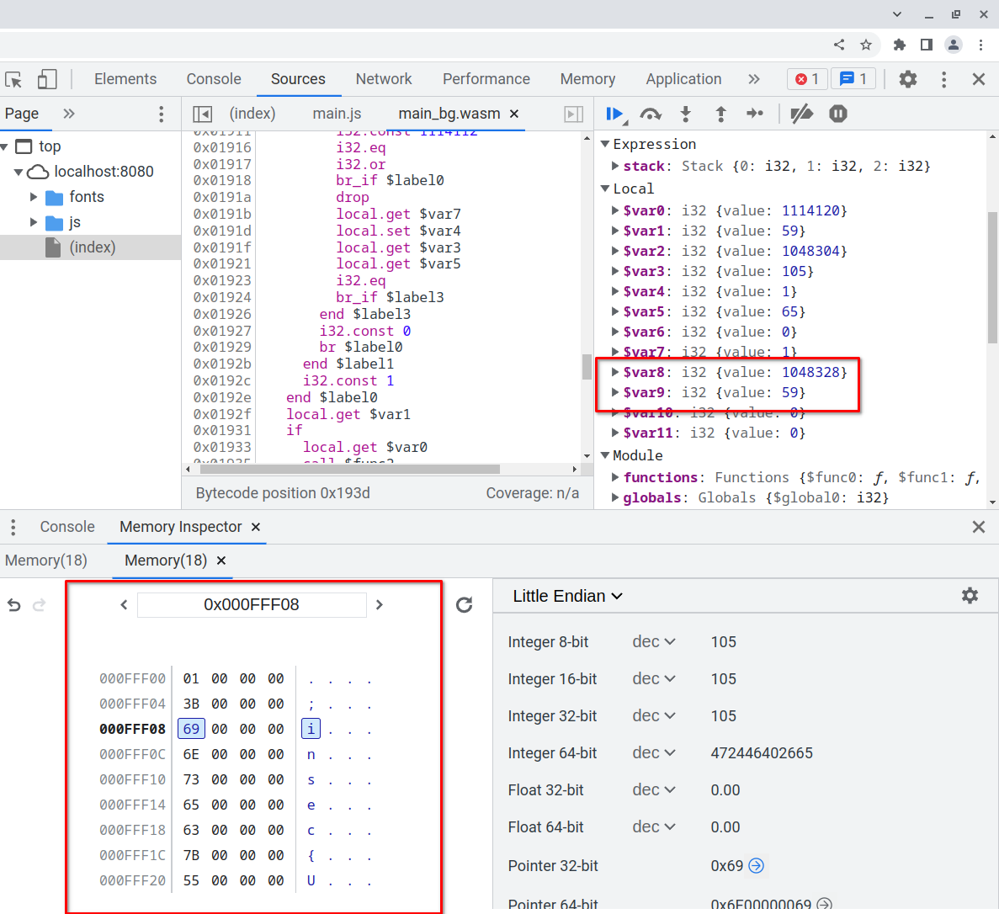

Here is the full output:

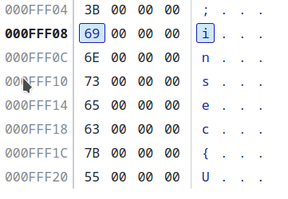
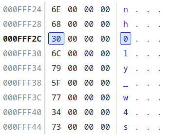
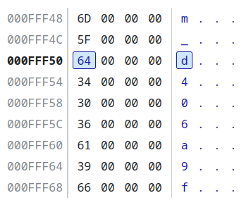
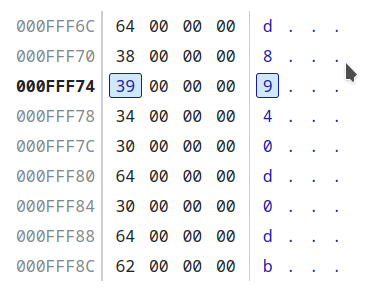
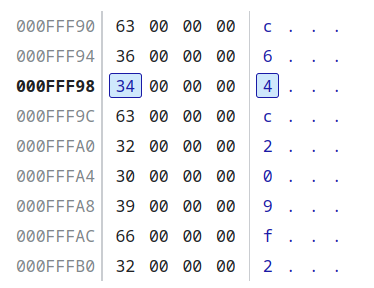
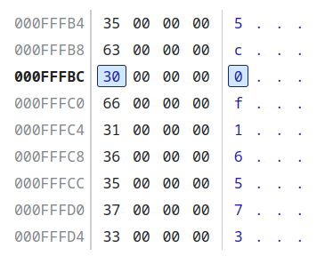
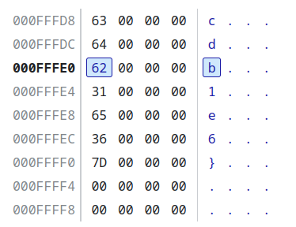


And that's it, ez challenge, FLAG: `insec{Unh0ly_w4sm_d406a9fd8940d0dbc64c209f25c0f16573cdb1e6}`
